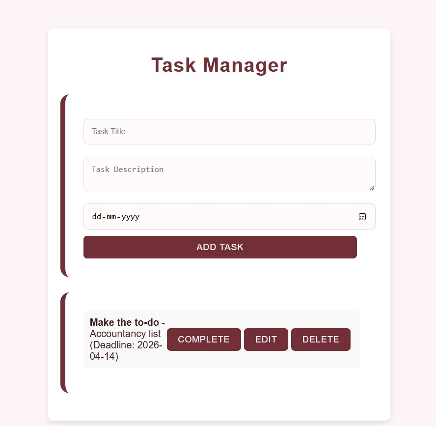

# Task Manager App

A simple and responsive **Task Manager** built with **HTML, CSS, and JavaScript**.  
You can **add**, **edit**, **complete**, and **delete** tasks with deadlines — all stored locally in your browser.

## Features
- Add tasks with title, description, and deadline  <br>
-  Edit existing tasks  <br>
-  Mark tasks as completed  <br>
-  Delete tasks  <br>
-  Auto-save using **Local Storage**  <br>

## Tech Stack
- **HTML5** <br>
- **CSS3** <br>
- **JavaScript (Vanilla JS)** <br>

##  Preview



## Setup Instructions
1. Clone this repository:
   ```
   git clone https://github.com/dish982/task-manager.git
   ```

2. Open the project folder:

   ```
   cd task-manager
   ```
   
3. Run it locally:

   * Simply open `index.html` in your browser

### This project is for educational and portfolio purposes only.

## 💡 Author

Made with ❤️ by [Disha](https://github.com/dish982)


